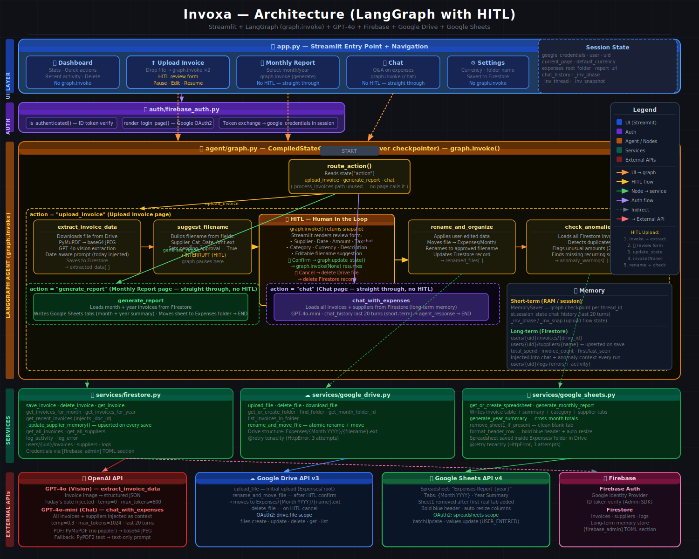
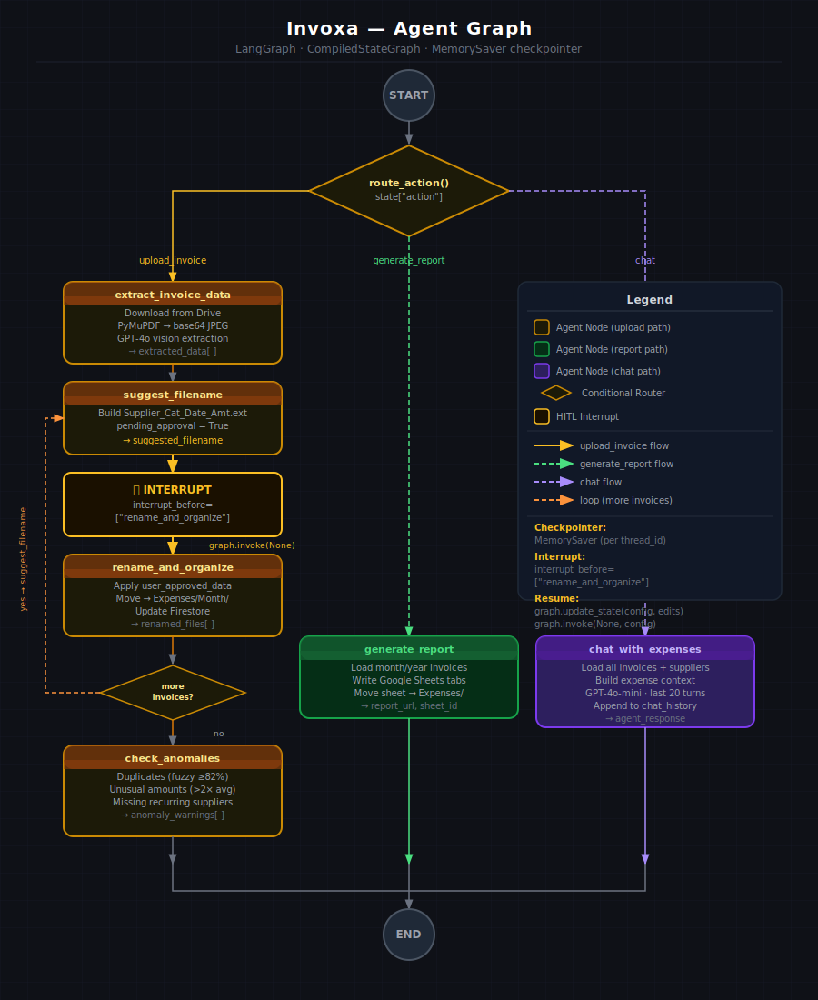

# Invoxa — Project Evaluation

**Course Assignment Submission**
**Project:** AI-powered Expense Invoice Productivity Agent
**Stack:** Streamlit · LangGraph · GPT-4o · Firebase · Google Drive · Google Sheets

> 📦 **Looking to run the project?** See the [Setup & Installation Guide](SETUP.md).

---

## Table of Contents

1. [Agent Purpose](#1-agent-purpose)
2. [Core Functionality](#2-core-functionality)
3. [User Interface](#3-user-interface)
4. [Technical Implementation](#4-technical-implementation)
5. [Documentation](#5-documentation)
6. [Optional Tasks Completed](#6-optional-tasks-completed)

---

## 1. Agent Purpose

### What Invoxa Does
Invoxa is an AI-powered expense management agent that automates the full lifecycle of business invoice processing — from file upload through data extraction, review, organisation, anomaly detection, and reporting — using a multi-step LangGraph pipeline with Human-in-the-Loop (HITL) oversight at key decision points.

### Why It Is Useful
Managing business invoices manually is slow, error-prone, and hard to audit. Invoxa solves this by:
- Eliminating manual data entry — GPT-4o vision extracts all fields automatically from PDFs or images
- Keeping files organised — invoices are renamed and moved to the correct Google Drive month folder automatically
- Catching mistakes — duplicate invoice detection and unusual amount warnings prevent costly errors
- Providing instant insights — natural language chat lets users query their expense data without building reports manually
- Maintaining full control — every AI decision passes through a human review screen before being committed

### Target Users
- Freelancers and sole traders managing their own invoices
- Small business owners without a dedicated accounting team
- Accountants or finance assistants processing high volumes of invoices
- Anyone using Google Drive as their document management system

---

## 2. Core Functionality



### 2.1 Invoice Upload & Extraction (Upload Invoice page)

The primary pipeline runs through a LangGraph `CompiledStateGraph`. When a user uploads a file:

1. **File Upload** — Accepts PDF, JPG, JPEG, PNG, WEBP
2. **Google Drive Upload** — File is immediately saved to the user's `Expenses/` root folder
3. **GPT-4o Vision Extraction** — The agent downloads the file from Drive and extracts:
   - Supplier name, invoice number, invoice date (YYYY-MM-DD)
   - Total amount, currency (ISO code), tax amount, tax rate
   - Category (from user-defined list), description

**PDF Processing strategy (cascading fallback):**
- PyMuPDF → converts pages to 2× zoom JPEG (preferred, no external dependencies)
- pdf2image + poppler → fallback if PyMuPDF fails
- PyPDF2 text extraction → last resort for text-based PDFs

**Extraction prompt** is dynamically built with today's date injected to prevent year misidentification (e.g. GPT guessing 2023 instead of 2026), and uses the user's custom category list.

### 2.2 Human-in-the-Loop (HITL) — Two Interrupt Points

**HITL 1 — Data Review (before rename_and_organize node)**

After extraction the graph pauses via `interrupt_before=["rename_and_organize"]`. Streamlit renders a review form where the user can:
- Edit any extracted field (supplier, date, amount, tax, currency, description)
- Select or create a new category on the fly
- Customise the suggested filename
- Confirm (resumes graph) or Cancel (deletes Drive file + Firestore record)

On confirm, `graph.update_state()` injects the user's edits and `graph.invoke(None)` resumes the graph from the interrupt checkpoint.

**HITL 2 — Anomaly Review (after check_anomalies node)**

If `check_anomalies` detects any warnings, the pipeline pauses in Streamlit (not at the graph level) and shows:
- 🔴 Duplicate invoice — same supplier + same amount (within 1%) + same date
- 🟡 Unusual amount — invoice exceeds 2× the supplier's historical average
- 🟡 Missing recurring supplier — supplier appeared in 2+ prior months but absent this month

The user can **Keep** (proceed to done) or **Discard** (delete from Drive and Firestore).

### 2.3 Anomaly Detection

The `check_anomalies` node uses three detection algorithms:

| Check | Criteria |
|---|---|
| **Duplicate** | Supplier similarity ≥ 82% (difflib fuzzy match) + amount within 1% + identical date |
| **Unusual Amount** | Invoice amount > 2× supplier's historical average (requires ≥2 prior invoices) |
| **Missing Recurring** | Supplier appeared in ≥ 2 prior months but absent from current month |

Duplicate detection uses `difflib.SequenceMatcher` to catch typos and abbreviations (e.g. "Amazon" vs "Amazon EU").

### 2.4 File Organisation

After HITL approval, the `rename_and_organize` node:
- Creates the correct month folder (`Expenses/March 2026/`) if it doesn't exist
- Atomically renames and moves the file in a single Google Drive API call
- Updates the Firestore record with the new filename
- Logs the activity for auditing

### 2.5 Monthly Reporting

The `generate_report` node creates or refreshes a Google Sheets spreadsheet:
- **Monthly tab** — full invoice table with category, supplier, amounts, tax
- **Year Summary tab** — cross-month totals grouped by month
- The spreadsheet is saved inside the `Expenses/` Drive folder
- Report URL is returned to the UI for a one-click "Open in Sheets" button

The Monthly Report page also renders inline charts:
- Category breakdown bar chart
- Top 5 suppliers bar chart
- Month-over-month line chart for the selected year

### 2.6 Expense Chat

The `chat_with_expenses` node provides a natural language interface:
- Loads all invoices and suppliers from Firestore into the system prompt context
- Uses GPT-4o-mini for cost efficiency
- Maintains a 20-turn conversation history
- Answers questions like "What did I spend on travel this year?" or "Which supplier costs the most?"
- Tax amounts, descriptions, and all invoice fields are included in context

### 2.7 Supplier Long-Term Memory

Every time an invoice is saved, `_update_supplier_memory()` upserts a supplier summary document in Firestore:
- `total_spend` — cumulative spend across all invoices
- `invoice_count` — number of invoices processed
- `first_seen` / `last_seen` — timestamps

This memory powers anomaly detection (average amount calculation, recurring supplier tracking) and enriches the chat context.

---

## 3. User Interface

### Navigation
- Single `app.py` entry point with custom sidebar radio navigation
- Streamlit's auto-generated multipage nav hidden via CSS
- Sidebar starts collapsed by default for a cleaner initial view
- Single-click navigation (rerun triggered on change)

### Pages

| Page | Purpose |
|---|---|
| 🏠 **Dashboard** | Quick stats, recent activity with delete, category chart, AI cost metric |
| ⬆️ **Upload Invoice** | Full HITL pipeline (upload → extract → review → anomaly check → done) |
| 📊 **Monthly Report** | Month/year selector, charts, generate/refresh Google Sheets report |
| 💬 **Chat** | Expense Q&A with suggested question chips and conversation history |
| ⚙️ **Settings** | Drive/Sheets config, currency, category management, AI cost monitoring, account |

### Dashboard Header
- Invoxa logo (emoji + name + tagline) on the left
- User profile (avatar, name, email, current month) compact on the right
- 5 metric cards: Total Expenses, Total Tax, Invoices Processed, Unique Suppliers, 🤖 AI Cost

### Category Management
- User-editable category list in Settings (one per line text area)
- Changes persisted to Firestore and applied immediately to:
  - GPT-4o extraction prompt (guides AI classification)
  - HITL review form (drives the category dropdown)
- New categories can be created on-the-fly during HITL review

---

## 4. Technical Implementation

### Architecture

```
Streamlit (UI) ──► graph.invoke() ──► LangGraph Pipeline
                                          │
                    ┌─────────────────────┼──────────────────────┐
                    │                     │                      │
               upload_invoice      generate_report            chat
                    │
          extract_invoice_data (GPT-4o vision)
                    │
          suggest_filename → ⏸ HITL 1 (Streamlit form)
                    │
          rename_and_organize (Google Drive)
                    │
          check_anomalies → ⏸ HITL 2 (if warnings)
                    │
                   END
```

### Agent Framework: LangGraph



- `StateGraph` with `AgentState` TypedDict for typed state management
- `MemorySaver` checkpointer for thread-based HITL state persistence
- `interrupt_before=["rename_and_organize"]` for the first HITL pause
- `graph.update_state()` + `graph.invoke(None)` pattern for resuming from interrupts
- `thread_id` (UUID per upload) ensures isolated state per user session
- Conditional routing via `route_action()` dispatcher (upload / report / chat)

### LLM Usage

| Model | Node | Settings | Purpose |
|---|---|---|---|
| `gpt-4o` | extract_invoice_data | temp=0, max_tokens=800 | Invoice vision extraction |
| `gpt-4o-mini` | chat_with_expenses | temp=0.3, max_tokens=1024 | Expense Q&A |

### Memory

**Short-term (session):**
- `st.session_state` — user credentials, current page, upload pipeline state
- `MemorySaver` — LangGraph checkpoint per `thread_id`, survives HITL interrupt/resume

**Long-term (Firestore):**
- `users/{uid}/invoices/` — all extracted invoice records
- `users/{uid}/suppliers/` — cumulative supplier spend/count memory
- `users/{uid}/ai_usage/` — per-call token and cost logs
- `users/{uid}/` profile — settings, categories, running AI cost total

### Error Handling

- **Tenacity retry** on all OpenAI and Drive API calls: exponential backoff (2–30s), 3 attempts max
- **Cascading PDF fallback**: PyMuPDF → pdf2image → PyPDF2 text
- **Graceful degradation**: Firestore failures return empty lists; year summary failure doesn't block monthly report
- **Contextual logging**: `log_error(uid, context, message, details)` stores structured error records in Firestore
- **User feedback**: `st.error()` / `st.warning()` / `st.status()` state indicators throughout the upload pipeline

### AI Cost Monitoring

Every OpenAI API call is metered:
- `response.usage` captured (prompt_tokens, completion_tokens)
- Cost calculated: `(prompt × input_price + completion × output_price) / 1_000_000`
- Stored in `users/{uid}/ai_usage/` with model, action, invoice_id, timestamp
- `firestore.Increment()` atomically updates running total on user profile
- Visible in Settings (by-model and by-action breakdown tables) and Dashboard (total cost metric)

**Pricing table (hardcoded, update as OpenAI changes rates):**
| Model | Input $/1M | Output $/1M |
|---|---|---|
| gpt-4o | $2.50 | $10.00 |
| gpt-4o-mini | $0.15 | $0.60 |

### Observability: LangSmith

- Env vars set via direct `tomllib` parse of `secrets.toml` **before** any LangGraph import — critical because `graph = build_graph()` runs at module import time
- EU region endpoint configured: `https://eu.api.smith.langchain.com`
- Zero-code tracing: every `graph.invoke()` automatically sends node-by-node traces to LangSmith
- `langgraph.json` created for LangGraph Studio local debugging (`langgraph dev`)

### Authentication

- Firebase Authentication with Google OAuth2
- `google_credentials` OAuth2 object stored in session state, passed to all Drive/Sheets calls
- Firebase Admin SDK for ID token verification (lazy-initialized on first Firestore call)
- Secrets managed via `.streamlit/secrets.toml` (never committed to git)

### Libraries Used

| Library | Version | Purpose |
|---|---|---|
| streamlit | ≥1.32.0 | Web UI framework |
| langgraph | ≥0.2.0 | Stateful agent graph |
| langchain | ≥0.2.0 | LLM utilities |
| langchain-openai | ≥0.1.0 | OpenAI integration |
| langsmith | ≥0.7.0 | Observability & tracing |
| openai | ≥1.30.0 | GPT-4o / GPT-4o-mini API |
| firebase-admin | ≥6.5.0 | Firestore Admin SDK |
| google-api-python-client | ≥2.128.0 | Drive & Sheets APIs |
| google-auth-oauthlib | ≥1.2.0 | Google OAuth2 flow |
| pymupdf | ≥1.23.0 | PDF to image (preferred) |
| pdf2image | ≥1.17.0 | PDF to image (fallback) |
| PyPDF2 | ≥3.0.0 | PDF text extraction (fallback) |
| pandas | ≥2.2.0 | Data tables and charts |
| tenacity | ≥8.3.0 | Retry with exponential backoff |
| Pillow | ≥10.3.0 | Image processing |

---

## 5. Documentation

### How to Run Locally

```bash
# 1. Clone and set up environment
git clone https://github.com/bspyrop/invoxa
cd invoxa
python -m venv venv && source venv/bin/activate
pip install -r requirements.txt

# 2. Configure secrets
cp .streamlit/secrets.toml.example .streamlit/secrets.toml
# Fill in: OPENAI_API_KEY, Firebase config, Google OAuth credentials, LangSmith key

# 3. Run
streamlit run app.py

# 4. (Optional) LangGraph Studio for visual debugging
langgraph dev  # then open LangGraph Studio app → http://localhost:2024
```

### Common Use Cases

**Upload and process an invoice:**
1. Open Upload Invoice page
2. Drag and drop a PDF or image
3. Wait for GPT-4o to extract data (~3–5 seconds)
4. Review and edit any fields in the HITL form
5. Select or create a category
6. Click Confirm — file is moved to `Expenses/March 2026/` in Drive
7. If a duplicate is detected, choose Keep or Discard

**Generate a monthly report:**
1. Open Monthly Report page
2. Select month and year
3. Click Generate Report
4. View charts inline or click Open in Sheets

**Query your expenses in natural language:**
1. Open Chat page
2. Click a suggested question or type your own
3. Examples:
   - "What is my total tax for this year?"
   - "Which supplier costs the most?"
   - "Show me all invoices over €500 in February"
   - "What did I spend on software subscriptions?"

**Manage categories:**
1. Open Settings → Category Labels
2. Edit the list (one per line)
3. Save — takes effect on the next invoice upload

**Monitor AI costs:**
1. Open Settings → AI Cost Monitoring
2. View total cost, breakdown by model (gpt-4o vs gpt-4o-mini), and breakdown by action (extract vs chat)
3. Expand full log to see per-call costs

### Technical Decisions

| Decision | Rationale |
|---|---|
| **LangGraph over plain LangChain** | Native HITL support via `interrupt_before` + `MemorySaver` checkpointing |
| **GPT-4o for extraction, GPT-4o-mini for chat** | Vision capability needed for extraction; mini sufficient for chat at lower cost |
| **PyMuPDF over pdf2image** | No external poppler dependency, faster, works on all platforms |
| **Firestore over SQL** | Schema-free suits variable invoice fields; Firebase Admin SDK included in Firebase Auth stack |
| **Full context injection for chat** | Simpler than RAG for current scale (<200 invoices); revisit with vector store when volume grows |
| **difflib for duplicate detection** | Built-in Python, no extra dependency; handles OCR variations and abbreviations |
| **Category stored per-user in Firestore** | Users have different business domains; hardcoded defaults ship with sensible defaults |
| **tomllib for LangSmith env setup** | LangGraph graph is built at module import time — must set env vars before any import |

---

## 6. Optional Tasks Completed

### Easy
| Task | Status | Details |
|---|---|---|
| Give the agent a personality | ✅ | Chat system prompt defines Invoxa as a clear, data-grounded expense assistant |

### Medium
| Task | Status | Details |
|---|---|---|
| **Calculate and display token usage and costs** | ✅ | Full per-call logging to Firestore; dashboard metric + settings breakdown table |
| **Add retry logic for agents** | ✅ | Tenacity decorator on all OpenAI and Drive API calls (3 attempts, exponential backoff) |
| **Implement long-term and short-term memory** | ✅ | Short-term: `MemorySaver` + session state. Long-term: Firestore invoices + supplier memory |
| **Implement one more function tool calling an external API** | ✅ | Google Sheets API integration for report generation (separate from Drive) |
| **Add user authentication and personalisation** | ✅ | Firebase Auth + Google OAuth2; per-user settings, categories, Drive folder paths |

### Hard
| Task | Status | Details |
|---|---|---|
| **Add LLM observability tool** | ✅ | LangSmith integrated with EU region endpoint; `langgraph.json` for LangGraph Studio |
| **Implement agent that integrates with external data sources** | ✅ | Agent reads Google Drive (file storage), Google Sheets (reporting), Firestore (memory) — three external integrations in a unified pipeline |

---

*Invoxa v1.0 — Built with LangGraph + GPT-4o + Google Drive + Firebase*
